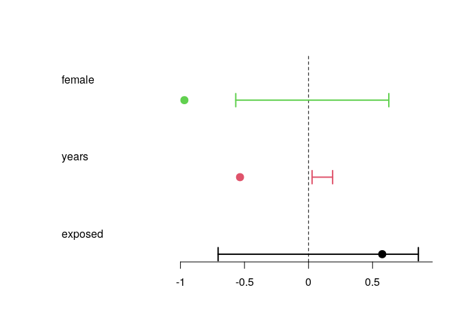

<!-- README.md is generated from README.Rmd. Please edit that file -->

# mc3logit: Matched Case-Control Conditional Logit

<!-- badges: start -->

[](https://lifecycle.r-lib.org/articles/stages.html#experimental)
<!-- badges: end -->

The `mc3logit` package implements permutation-based inference for
conditional logistic regression models fit to **matched case-control
data** – the kind of data you get when several individuals share the
same event and only some of them “act” (e.g. several police officers
responding to the same incident, only some of whom draw their
firearm). It builds on `survival::clogit()` and adds permutation-based
p-values and confidence intervals, following the approach used by
Ridgeway (2016) for exactly this kind of matched-officer data.

The package also ships:

- Two data simulators, `sim_events()` and `sim_events2()`, for
  generating synthetic matched case-control event data (useful for
  learning the package, and for power / type-I-error studies).
- `exposure_dyn()`, for computing running direct/indirect “exposure”
  covariates from a longitudinal event log without double-counting or
  looking into the future.
- `print()`/`plot()`/`confint()` methods for exploring and reporting a
  fitted `clogit_perm` model.

> This package originated in George G. Vega Yon’s
> [use_of_force](https://github.com/gvegayon/use_of_force) project (see
> `LICENSE`); this repository packages it standalone with expanded
> vignettes and documentation.

## Installation

<!-- You can install the released version of mc3logit from [CRAN](https://CRAN.R-project.org) with: -->
<!-- ``` r -->
<!-- install.packages("mc3logit") -->
<!-- ``` -->

You can install `mc3logit` from [GitHub](https://github.com/) with:

``` r
# install.packages("devtools")
devtools::install_github("sima-njf/mc3logit_project", build_vignettes = TRUE)
```

## Example

This is a basic example which shows you how to solve a common problem:

``` r
library(mc3logit)
#> Loading required package: survival

# Simulating data
x <- sim_events(200, 300, seed = 122)

# Fitting
ans <- clogit_perm(
  nperm = 1000,
  pointed000001 ~ female + years + exposed + strata(incidentid),
  data = x
  )
```

``` r
print(ans)
#> 
#> CONDITIONAL LOGIT (WITH PERMUTATION)
#>   N events: 83
#>     N perm: 1000
#>          N: 607
#>        AIC: 94.01
#>        BIC: 101.27
#> MODEL PARAMETERS (odds):
#>  female       0.38*** [ 0.57,  1.87] < 0.01
#>   years       0.59*** [ 1.03,  1.21] < 0.01
#> exposed       1.78    [ 0.49,  2.36]   0.21
plot(ans)
```



## Learning more

The package ships four vignettes with worked examples and background:

- `vignette("getting-started", package = "mc3logit")` – simulate data,
  fit `clogit_perm()`, and read off `print()`/`plot()`/`confint()`
  output.
- `vignette("permutation-inference", package = "mc3logit")` – how
  `find_candidates()`/`permute()` build valid within-stratum
  permutations, how p-values and confidence intervals are computed,
  and why permutation inference helps with small/sparse matched
  strata.
- `vignette("simulating-data", package = "mc3logit")` – the
  `sim_events()`/`sim_events2()` data-generating process, tuning
  effect sizes, and using `nsims` for power/type-I-error studies.
- `vignette("dynamic-exposure", package = "mc3logit")` – computing
  direct and indirect exposure covariates from an event log with
  `exposure_dyn()`.

Browse them locally with `browseVignettes("mc3logit")` once installed,
or read the source under [`vignettes/`](vignettes/).

## References

Ridgeway, G. (2016). Officer risk factors associated with police
shootings: a matched case-control study. *Statistics and Public
Policy*, 3(1), 1-6.

Knijnenburg, T. A., Wessels, L. F. A., Reinders, M. J. T., &
Shmulevich, I. (2009). Fewer permutations, more accurate P-values.
*Bioinformatics*, 25(12), 161-168.
